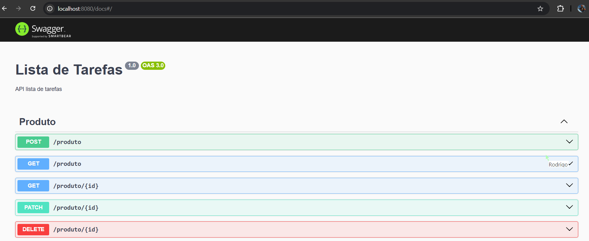

### Criando api

#### Screens



- npx next new backend
  cd backend

* npm run start:dev

#### Primeira que vou salvar o projeto

git init
git add .
github e pegar colocar o script

#### Atualizar o projeto Git

git add .
git commit -m "descrição als"
git push

#### Documentação com Swagger

```
npm install --save @nestjs/swagger
```

```
npm install swagger-ui-express
```

- config no main.ts

```
  const configSwagger = new DocumentBuilder()
    .setDescription('API lista de tarefas')
    .setBasePath('localhost:8080')
    .setTitle('Lista de Tarefas')
    .setVersion('1.0')
    .build();

  const documentFactory = () => SwaggerModule.createDocument(app, configSwagger)
  SwaggerModule.setup('docs', app, documentFactory)
```

- nest-cli.json

```
"compilerOptions": {
  "deleteOutDir": true,
  "plugins": [
    "@nestjs/swagger/plugin"
  ]
}
```
